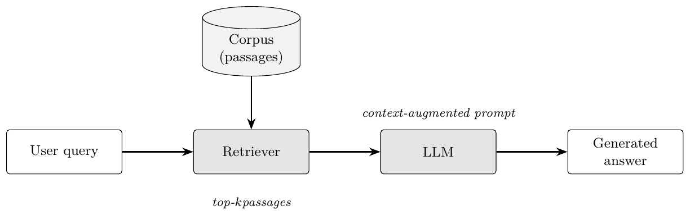

# Chapter 2 Figures — Design Spec

**Created:** 2026-08-09
**Status:** ✅ **BUILT 2026-08-09.** All six figures exist, are inserted in `chapter2.tex`, and
build clean (138 pages, 0 errors). See task **K6** in `THESIS_FINAL_SUBMISSION_TASKS.md` for the
as-built record and the two open follow-ups.

⚠️ **Two things changed from the spec below during the build:**
1. **Figures 2.3 and 2.4 swapped.** The chapter reads taxonomy-then-placement, so the taxonomy
   prints as **2.3** and the QE-layer placement as **2.4**. Files were renamed to match the
   printed numbers.
2. **Fig 2.1 used the University of Khartoum example** (facts verified) and the Gao et al.
   citation was added to `References.bib` as `gao_2024_ragsurvey`.
**Companion:** `CH2_FIGURES_PLAN.md` (why we are doing this, approach decision, risks).
**Task-list entry:** K6 in `THESIS_FINAL_SUBMISSION_TASKS.md`.

Every figure below is specified down to its exact labels, so that at build time nothing is
invented. Every Arabic string, number and claim is traced to a file in this repo.

---

## Set as approved by Elhaj (2026-08-09)

| # | § | Figure | Origin | Route |
|---|---|---|---|---|
| 2.1 | 2.1.2 | RAG system, with a worked example | **rebuild** (current one is too thin) | PaperBanana → TikZ fallback |
| 2.2 | 2.1.3 | Sparse vs dense retrieval | restore from archive + 2 fixes | TikZ |
| 2.3 | 2.1.4 | Where the QE layer goes (before/after) | new | TikZ |
| 2.4 | 2.1.4 | QE taxonomy — four families | redesign of archived | TikZ |
| 2.5 | 2.1.5 | Arabic retrieval challenges | new | TikZ |
| 2.6 | 2.2.4 | The three metrics on one worked example | new | TikZ |

**Dropped on Elhaj's call:** the encoder-vs-decoder Transformer figure that was proposed for
§2.1.1. §2.1.1 stays text-only.

**Still deferred:** the §2.5 research-timeline figure (reason in `CH2_FIGURES_PLAN.md` §5 — it
commits us visually to a gap claim that Phase A review flag 5 has not re-verified).

Chapter 2 goes from **1 figure to 6**. Existing `fig:rag_arch` keeps its label and its number.
No `\ref` anywhere breaks — verified, there are zero hardcoded "Figure 2.x" strings in
`Chapters/`.

---

# Fig 2.1 — RAG system, with a worked example

**Section:** §2.1.2 (`chapter2.tex:48-53`), replacing the current diagram.
**Label:** `fig:rag_arch` (unchanged).

### Why the current one is not good enough



Five boxes in a row: User query → Retriever → LLM → Generated answer, with a Corpus cylinder
above. Three concrete problems:

1. **It never shows where the index comes from.** A reader who does not already know RAG cannot
   tell that indexing happens once, offline, and retrieval happens per query. That split is the
   whole engineering shape of a RAG system.
2. **No example.** "top-$k$" and "context-augmented prompt" are labels, not understanding.
3. **The retrieval bottleneck is invisible.** §2.1.2 ends on the sentence that motivates the
   entire thesis — *"If the retriever fails to surface relevant documents, the generator cannot
   compensate for this deficiency regardless of its capabilities"* — and the figure beside it
   does not mark that point at all.

Also a cosmetic defect: the *context-augmented prompt* label sits above the LLM box rather than
on the arrow it describes.

### Scope — decided by Elhaj, 2026-08-09

> *"i want the rag example to be a general rag example, just like how rag is explained in top
> papers, fully and clearly, not related to our thesis"*

So: **English throughout, no Arabic, no MIRACL, no query enhancement.** This figure teaches RAG
and nothing else. Everything thesis-specific moves out — the QE layer to Fig 2.3, the Arabic
material to Fig 2.5. Dropped from the earlier draft of this spec: the MIRACL query-34 example
and the 86-vs-83 hallucination note (that one is kept in reserve for Chapter 4).

### The field-standard structure we are following

The canonical presentation is Figure 2 of Gao et al., *Retrieval-Augmented Generation for Large
Language Models: A Survey* (arXiv:2312.10997), whose caption defines the three steps:

> "1) **Indexing.** Documents are split into chunks, encoded into vectors, and stored in a
> vector database. 2) **Retrieval.** Retrieve the Top k chunks most relevant to the question
> based on semantic similarity. 3) **Generation.** Input the original question and the
> retrieved chunks together into LLM to generate the final answer."

Numbered three stages is what nearly every RAG paper since has used. We follow it.

**One deliberate deviation.** The canonical figure hardwires a *vector* database and *semantic*
similarity. We draw the index generically — `Index (sparse, dense, or hybrid — Section 2.1.3)`.
Two reasons, both good: RAG does not require dense retrieval, and our own §2.1.3 gives BM25
equal billing, so a vector-only figure would contradict the section three pages later. This
makes our figure *more* correct than the one it is modelled on, and it must be preserved
through any PaperBanana regeneration.

### Layout

```
┌─ ① INDEXING ─────────────────── offline, performed once ─────────────────┐
│                                                                          │
│   Documents ──> split into chunks ──> encode ──> Index                    │
│    (corpus)                                     (sparse, dense or hybrid) │
└──────────────────────────────────────────────────────┬───────────────────┘
                                                       │
┌─ ② RETRIEVAL ──────────────────── per query ─────────┼───────────────────┐
│                                                      v                    │
│   User question ─────────────────────> Retriever ──> top-k chunks         │
│                                                                           │
│      ▲ retrieval bottleneck: a chunk not returned here cannot be          │
│        recovered by the generator downstream                              │
└──────────────────────────────────────────────────────┬────────────────────┘
                                                       │
┌─ ③ GENERATION ───────────────────────────────────────┼────────────────────┐
│                                                      v                     │
│   Prompt = instruction + top-k chunks + question ──> LLM ──> Answer        │
│                                                              (grounded,    │
│                                                               attributable)│
└────────────────────────────────────────────────────────────────────────────┘

┌─ WORKED EXAMPLE, threaded through all three ──────────────────────────────┐
│  question   "When was the University of Khartoum founded?"                │
│  retrieved  "...founded in 1902 as Gordon Memorial College; it became     │
│              the University of Khartoum in 1956..."                       │
│  answer     "It was founded in 1902 as Gordon Memorial College and        │
│              became the University of Khartoum in 1956."  [chunk 2]       │
└───────────────────────────────────────────────────────────────────────────┘
```

Stage ① in muted grey (`thData`) to read as background; ②③ in full colour; the example strip
tinted and visually subordinate so it reads as illustration, not as another stage.

### Exact labels

| Element | Text |
|---|---|
| Stage headers | `1. Indexing` · `2. Retrieval` · `3. Generation` |
| Stage ① strip | `offline — performed once` |
| Stage ① boxes | `Documents` · `Split into chunks` · `Encode` · `Index (sparse, dense, or hybrid)` |
| Stage ② boxes | `User question` · `Retriever` · `Top-k chunks` |
| Stage ③ boxes | `Prompt: instruction + chunks + question` · `LLM` · `Answer` |
| Bottleneck note | `Retrieval bottleneck — a relevant chunk not returned here cannot be recovered by the generator` |
| Contrast note (small) | `without retrieval the model answers from parametric memory alone` |

The bottleneck note is **not** thesis-specific — it is the standard motivation given in the RAG
literature, and it is the sentence §2.1.2 ends on (`chapter2.tex:46`). It stays.

### The worked example

**Recommended:** the University of Khartoum question above. It is general in mechanism (plain
English, ordinary factual QA — exactly the shape used in the RAG literature), the answer is a
real verifiable fact rather than invented text, and the subject is quietly appropriate for the
document it appears in. It does not touch Arabic IR, MIRACL, or query enhancement.

⚠️ **Fact-check before print:** Gordon Memorial College founded 1902, became the University of
Khartoum 1956. Confirm against a citable source, or fall back to the neutral option below.

**Neutral fallback if preferred:** `"When was the Transformer architecture introduced?"` →
chunk quoting Vaswani et al. → `"In 2017."` Already in `References.bib` as
`vaswani_2017_attention`, so it is citable with zero new work.

### Caption

> **Figure 2.1** The three stages of a RAG system. Indexing is performed once, offline;
> retrieval and generation run per question. The retriever's output bounds everything
> downstream — a relevant chunk that is not retrieved cannot be recovered by the generator,
> which is what motivates the query-side interventions studied in this thesis. Adapted from
> Gao et al. [ref].

### Attribution — one bibliography change needed

⚠️ **`References.bib` does not contain the Gao et al. RAG survey** (arXiv:2312.10997) — checked,
zero hits. Two honest options:

- **(a) Add it and cite it — recommended.** Correct attribution for the three-stage framing, and
  a RAG survey citation strengthens §2.1.2 regardless of the figure. **Renumbering is safe:**
  IEEE numbers by order of first appearance, so a new citation early in Chapter 2 shifts the
  printed number of much of the bibliography — but nothing in the thesis hardcodes a citation
  number (verified: zero literal `[n]` strings in any `Chapters/*.tex`), so BibTeX handles it
  automatically. Task C6 (IEEE order-of-appearance, done 2026-07-29) stays satisfied because
  the ordering rule is enforced by the style, not by hand.
- **(b) Cite nothing.** The indexing/retrieval/generation decomposition is now generic field
  knowledge rather than one paper's contribution, so a caption that simply describes the figure
  is defensible.

Recommendation: **(a)**. Dr. Tahani explicitly sanctioned drawing on the literature, and an
attributed figure is stronger than an unattributed one.

### Build route — PaperBanana, with a gate

Elhaj asked for this figure to be produced with **PaperBanana**
(`github.com/llmsresearch/paperbanana`, already installed at v0.1.2). Straight assessment
before we spend on it:

**What it does.** Multi-agent pipeline — planner writes a structured visual layout from
methodology text plus a caption, a visualiser renders it with an image model
(Nano-Banana-Pro / GPT-Image), a critic reviews and revises over N iterations.

**What that means for this thesis, stated plainly:**

| | |
|---|---|
| Output format | **Raster PNG/JPEG/WebP.** Every other figure in this thesis is vector PDF. |
| Text accuracy | Image models still misspell labels. A typo baked into a raster is not editable — it can only be regenerated. |
| Arabic | Band C is Arabic RTL. Image models mangle Arabic script routinely. **This is the highest-risk element.** |
| Style | Will not match `_style.tex`, i.e. Figs 2.2–2.6 and all of 3.1–3.9. |
| Cost | Needs a Gemini API key and paid image generations across several refinement iterations. |

**Proposed handling — generate, then gate.** Run it, then accept only if *all five* hold:

1. Every English label spelled correctly.
2. Arabic in Band C renders correctly, RTL, no broken glyphs, no invented words.
3. Rendered at ≥ 300 dpi for the printed width, no visible softness.
4. Placed next to Fig 2.2 on screen, it does not look like it came from a different thesis.
5. The three bands are actually distinguishable — the structure survived generation.

If any fail, we implement **this same spec** in TikZ. The spec above is the deliverable either
way, so no work is wasted, and PaperBanana's real contribution may turn out to be the
*composition* rather than the final asset — which is a fine outcome.

**AI Suggestion — my recommendation:** run PaperBanana with the Arabic example **removed** from
the prompt (English structural labels only), then add Band C in LaTeX underneath the generated
image, or overlay it. That gets PaperBanana's design quality on the part it is good at and
keeps the Arabic under our control, where we know it renders correctly.

**Prerequisite from Elhaj:** the Gemini API key, set as an environment variable — run
`paperbanana setup` yourself (it is an interactive wizard, I cannot run it here). **Do not paste
the key into the chat.**

---

# Fig 2.2 — Sparse vs dense retrieval

**Section:** §2.1.3 (`chapter2.tex:55-79`), after the Hybrid Retrieval subsubsection.
**Label:** `fig:sparse_vs_dense`
**Source:** `thesis_figures/archive/system_diagrams_dropped/fig_2_3_dense_vs_sparse.tex`

Two parallel lanes, already laid out and compiling:

| Sparse (BM25) | Dense (mDPR) |
|---|---|
| Query terms | Query text |
| Tokenise + stem | Encoder → 768-d vector |
| Term-frequency scoring | Inner product with passages |
| Inverted index | FAISS index |
| Top-*k* passages | Top-*k* passages |

### Two defects to fix before it goes back in

1. **Text collision.** The italic annotation *"complementary strengths: BM25 high recall, mDPR
   high precision"* is placed between the two lanes and overlaps the box borders — visible in
   `archive/.../png/fig_2_3_dense_vs_sparse.png`. **Move it into the caption.**
2. **`768-d` must be verified.** ✅ Checked: `chapter3.tex:70` — *"768-dimensional embeddings"*
   for `castorini/mdpr-tied-pft-msmarco`. Correct as drawn, leave it.

### Also worth adding

A one-line failure annotation under each lane, since the *contrast* is the point of the figure
and §2.1.3 states both weaknesses in prose:
- under sparse: `fails on vocabulary mismatch`
- under dense: `fails on rare terms and entity names`

### Caption

> **Figure 2.2** Sparse and dense retrieval compared. The two families fail on different inputs
> — BM25 on vocabulary mismatch, dense retrieval on rare terms and named entities — which is
> what makes their fusion (Section 2.1.3) worthwhile.

---

# Fig 2.3 — Where the query-enhancement layer goes

**Section:** §2.1.4, near `chapter2.tex:106` ("These QE techniques operate as modular layers…").
**Label:** `fig:qe_layer`
**Requested by:** Osman, `thesis_figures/FIGURE_NOTES_MOHAMMED.md` §1.

### The one job this figure has

§2.1.4 claims QE is *modular* — retriever-agnostic, no reindexing, deployable incrementally.
That claim is the reason the thesis chose QE over the alternatives. It is currently made in
prose only.

### Layout — deliberately a before/after, so it cannot be confused with Fig 2.1

```
BEFORE   q ─────────────────────> Retriever ──> top-k ──> LLM ──> answer
                                      ▲
                                    index

AFTER    q ──> ┌──────────┐ ──q′──> Retriever ──> top-k ──> LLM ──> answer
               │    QE    │            ▲
               │  layer   │          index          ── unchanged ──
               └──────────┘
                    ▲
                  LLM
```

The QE box in `thHi` (the palette's "our contribution" colour, `#0D4D63`). Everything to the
right of the retriever drawn identically in both rows, with a bracket labelled
**`unchanged — same index, same retriever, same generator`**. That bracket *is* the modularity
argument.

Kept visually much lighter than Fig 2.1: no bands, no example, five boxes per row. Fig 2.1
answers "what is RAG"; Fig 2.3 answers "what one thing does this thesis change". Different
weight, different job, three pages apart.

### Caption

> **Figure 2.3** Query enhancement as a modular pre-retrieval layer. The user query *q* is
> rewritten to *q′* before it reaches the retriever; the index, the retriever and the generator
> are untouched, which is what makes the technique deployable on an existing system.

---

# Fig 2.4 — Query-enhancement taxonomy

**Section:** §2.1.4, after the four `\subsubsection`s (`chapter2.tex:104`).
**Label:** `fig:qe_taxonomy`
**Source:** redesign of `archive/system_diagrams_dropped/fig_2_2_qe_taxonomy.tex`

### Why a redesign and not a restore

The archived figure splits QE into *lexical/statistical* vs *LLM-based generative*. §2.1.4 was
since rewritten around **Song and Zheng's four atomic operations** — expansion, decomposition,
disambiguation, abstraction (`chapter2.tex:84`, cite `song_2024_a`). The old figure no longer
matches the text it would sit beside. Restoring it as-is would put a figure and its own section
in contradiction.

### Structure

```
                          Query Enhancement
                                 │
        ┌──────────────┬─────────┴─────────┬──────────────────┐
    Expansion      Decomposition     Disambiguation      Abstraction
        │            RQ-RAG          Rewrite-Retrieve-   step-back
        │           [chan_2024]      Read [ma_2023]      [zheng_2023]
        │
   ┌────┴──────────────┐
 lexical            LLM-based
 PRF, RM3        HyDE [gao_2022]
                 Query2Doc [wang_2023]  ★
                 GRF [mackie_2023]
                 CSQE [lei_2024]        ★
```

★ = highlighted in `thHi`, the two techniques the thesis builds on. Every leaf carries the
citation key that already exists in `References.bib` — all five verified present in
`chapter2.tex:84-104` and §2.5.

### Osman's edit, carried forward

Delete the in-image annotation *"built on in this thesis"* (it currently clips the dashed box)
and state it in the caption instead.

### On the original archiving reason

It was archived for overlapping with Table 2.1. That does not hold: Table 2.1 is a flat list of
reviewed papers with datasets and headline results; this figure shows the *structure of the
field* and where our two techniques sit in it. Different jobs, and the table cannot show
hierarchy.

### Caption

> **Figure 2.4** Taxonomy of query-enhancement techniques, following the four atomic operations
> of Song and Zheng [ref]. This thesis builds on the two highlighted expansion techniques:
> Query2Doc and CSQE.

---

# Fig 2.5 — Arabic retrieval challenges  ★ the most important figure in the set

**Section:** §2.1.5 (`chapter2.tex:116-133`), replacing the closing "morphological gap" paragraph
as the section's visual summary.
**Label:** `fig:arabic_challenges`

### Why this one matters most

It is the only figure in the chapter that is entirely ours, it explains the hardest and most
thesis-specific material, and it is the visual form of the problem statement. It is also the
figure most likely to be pointed at in the viva.

### Layout — four panels converging on one consequence

```
┌── ① MORPHOLOGY ────────┐  ┌── ② ORTHOGRAPHY ───────┐
│  root  ك-ت-ب            │  │   إبن الهيثم            │
│    ├── كِتاب   book     │  │        vs               │
│    ├── كاتب   writer   │  │   ابن الهيثم            │
│    ├── مكتبة  library  │  │  same person,           │
│    └── مكتوب  written  │  │  two spellings          │
└─────────────────────────┘  └─────────────────────────┘
┌── ③ DIACRITICS ────────┐  ┌── ④ DIGLOSSIA ─────────┐
│    المَثَانةُ            │  │  query:   dialect      │
│        vs               │  │  corpus:  MSA          │
│    المثانة              │  │  systematic mismatch   │
└─────────────────────────┘  └─────────────────────────┘
              │        │        │        │
              └────────┴───┬────┴────────┘
                           v
        ┌──────────────────────────────────────────┐
        │  one concept  →  many surface forms      │
        │  BM25 scores them as unrelated terms     │
        │           ↓                              │
        │      relevant passage missed             │
        └──────────────────────────────────────────┘
                           │
                           v
              query-side remedy: §2.1.4
```

### Exact Arabic strings and where each comes from

| Panel | String | Source |
|---|---|---|
| ① | `ك-ت-ب`, `كِتاب`, `كاتب`, `مكتبة`, `مكتوب` | `chapter2.tex:122`, verbatim |
| ② | `إبن الهيثم` vs `ابن الهيثم` | **`chapter4.tex:130`**, verbatim |
| ③ | `المَثَانةُ` vs `المثانة` | **`chapter4.tex:130`**, verbatim |
| ④ | MSA/dialect, no specific string | `chapter2.tex:125` |

**Deliberate design choice.** Panels ② and ③ use the exact examples that Chapter 4's error
analysis found *empirically* on our own baseline run. Chapter 2 therefore predicts precisely
what Chapter 4 measures, and an examiner who reads both sees the thesis close its own loop.
`chapter4.tex:130` also supplies a fourth real example — `آزوت` vs `نيتروجين` for nitrogen — a
pure vocabulary mismatch, available if a fifth panel is wanted.

Also worth noting: `إبن الهيثم` is not a decorative example. It is **MIRACL Arabic dev query
32**, verbatim in `data/miracl_ar/topics.tsv:4` — a real query in the evaluation set, spelled
the non-standard way by the person who wrote it.

### Technical note

Needs `polyglossia` + `\newfontfamily\arabicfont[Script=Arabic,Scale=1.2]{Arial}` in the
standalone preamble, with `\textarabic{}` inside nodes. **Verified working 2026-08-09** — probe
in `scratchpad/artest/`, Arabic rendered correctly RTL including the `كِتاب` diacritic.

⚠️ Panel ③ hinges on diacritics being visible at print size. `المَثَانةُ` at `\small` inside a
TikZ node needs checking in the rendered PDF at 100%, not on screen.

### Caption

> **Figure 2.5** Four properties of Arabic that break lexical retrieval. Each produces multiple
> surface forms of one concept, which a term-matching retriever scores as unrelated. The
> orthographic and diacritic examples are drawn from the failure analysis of this thesis's own
> baseline (Section 4.2).

---

# Fig 2.6 — The three evaluation metrics on one worked example

**Section:** §2.2.4 (`chapter2.tex:196-244`), after the MRR definition.
**Label:** `fig:metrics_example`

### Why

NDCG@10 is the headline number of the whole thesis — every table, the abstract, the
justification for changing the title from *Recall* to *Quality*. §2.2.4 defines it with two
equations and no intuition. It is the single most likely thing to be asked about in the viva.

**One example covers all three metrics**, which is stronger than three separate figures and
shows *why they disagree* — the point a definition list cannot make.

### The worked example (arithmetic verified 2026-08-09)

One query. **4 relevant passages exist in the corpus.** The retriever returns 10; relevant ones
land at ranks **2, 5 and 9**. MIRACL uses binary relevance, matching `qrels.tsv`.

```
rank    1     2     3     4     5     6     7     8     9    10
rel     ·     ●     ·     ·     ●     ·     ·     ·     ●     ·
disc  1.000 0.631 0.500 0.431 0.387 0.356 0.333 0.315 0.301 0.289
gain    0   0.631   0     0   0.387   0     0     0   0.301   0
```

```
DCG@10   = 0.631 + 0.387 + 0.301                   = 1.3188
IDCG@10  = 1.000 + 0.631 + 0.500 + 0.431           = 2.5616   (ideal: all 4 at the top)
NDCG@10  = 1.3188 / 2.5616                         = 0.5148
Recall@10 = 3 of 4 found                           = 0.75
MRR      = first relevant at rank 2 → 1/2          = 0.50
```

Three different numbers from one ranking. The figure's punchline: **Recall@10 asks *did we find
them*, MRR asks *how fast was the first one*, NDCG@10 asks *are they near the top*.**

Design notes:
- Discount row makes the positional penalty visible — a rank-1 document is worth **3.46×** a
  rank-10 document.
- 0.5148 was chosen deliberately to sit inside the thesis's real range (0.4621 → 0.7137), so
  the example reads as plausible rather than as a toy.
- All values recomputed at build time by a script, never typed by hand.

### Caption

> **Figure 2.6** The three retrieval metrics on one ranking. Four relevant passages exist; three
> are retrieved, at ranks 2, 5 and 9. Recall@10 counts how many were found, MRR rewards the
> first hit's position, and NDCG@10 discounts every hit by its rank — which is why the three
> report 0.75, 0.50 and 0.515 for the same result.

---

# Build order

1. **Fig 2.2** — restore, fix the collision, recompile. Fastest, re-validates the toolchain.
2. **Fig 2.5** — Arabic challenges. Highest value; the Arabic-in-TikZ pattern is unique to it,
   so surprises surface early.
3. **Fig 2.3** then **Fig 2.4** — same section, built together so they read as a pair.
4. **Fig 2.6** — numbers generated by script into the TikZ source, not typed.
5. **Fig 2.1** — PaperBanana run, gate, TikZ fallback. Last, because it needs the API key and
   is the only item with an external dependency.
6. Insert all six with captions and labels, rebuild, check the List of Figures and every float
   placement in the rendered PDF.

Per figure: write `system_diagrams/fig_2_N_*.tex` → `xelatex` → copy PDF to `output/pdf/` →
render PNG and **look at it** → then insert.

⚠️ **Filenames must match the printed numbers.** The archived sources are named
`fig_2_2_qe_taxonomy` and `fig_2_3_dense_vs_sparse`, but under this spec the taxonomy becomes
**2.4** and dense-vs-sparse becomes **2.2**. Rename on restore, or we repeat the legacy-filename
confusion that hit Figures 4.5/4.6 (task H1b).

---

# Open items for Elhaj

**Resolved 2026-08-09:** Fig 2.1 is a general, English-only RAG figure following the Gao et al.
three-stage structure. No Arabic, no MIRACL, no QE. This also removes the Arabic-in-image-model
risk from the PaperBanana run entirely — the biggest worry in the earlier draft is gone.

Still open:

1. **Gemini API key** — set it yourself via `paperbanana setup` (interactive, I cannot run it
   here). **Do not paste the key into the chat.** Fig 2.1 is blocked on this; Figs 2.2–2.6 are
   not, so building starts without it.
2. **Fig 2.1 worked example** — University of Khartoum (recommended, needs a source check) or
   the Transformer/Vaswani fallback (already in `References.bib`, zero extra work)?
3. **Gao et al. citation** — add to `References.bib` and attribute the figure (recommended), or
   leave the caption unattributed?
4. **Fig 2.5 fifth panel** (`آزوت` vs `نيتروجين`) — four panels or five?
   Recommendation: four; the vocabulary-mismatch case is already implied by panel ①.

None of these block the start of work. Figures 2.2, 2.5, 2.3, 2.4 and 2.6 can all be built now.
